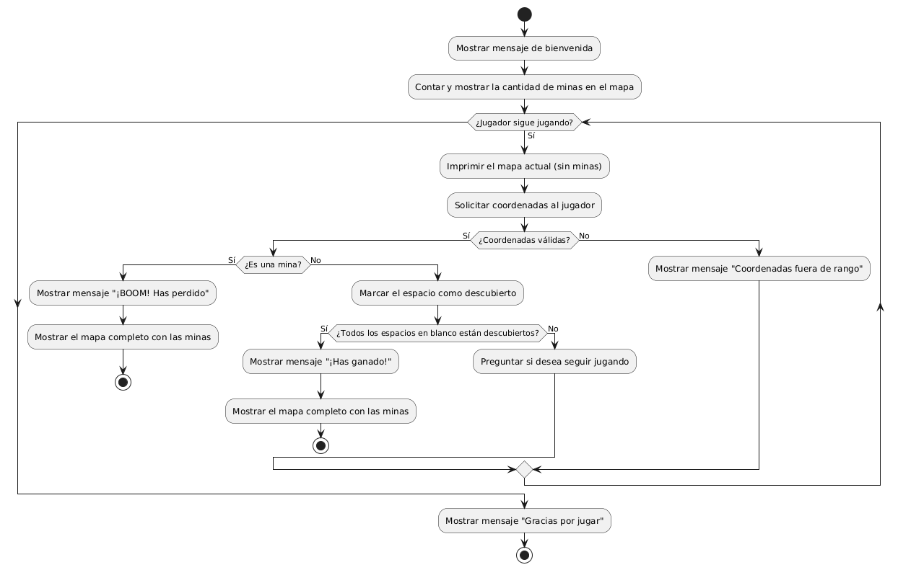

# Taller 2: Juego del Busca Minas

## Objetivo

El objetivo de este taller es crear un programa en C similar al juego del busca minas.

El mapa de minas debe crearse usando un array de dos dimensiones, donde un guión (`-`) representa un espacio en blanco y un asterisco (`*`) una mina. El programa debe iniciar imprimiendo un mensaje que indique cuantas minas hay en el mapa, a continuación, debe haber un bucle `while` que pregunte al jugador que indique las coordenadas de donde cree que hay un espacio en blanco; el bucle se debe repetir mientras el jugados quiera seguir jugando o encuentre todos los espacios en blanco.

En caso de que el jugador indique la posición de una mina, se rompe el bucle y se le indica al jugador que ha perdido mostrando en pantalla el mapa de minas y la posición donde estaba la mina encontrada.

El siguiente diagrama muestra la lógica del juego.

## Contenido

* [buscaminas.c](code/buscaminas.c): Implementación del juego del buscaminas en C.

* [diagrama-buscaminas.txt](code/diagrama-buscaminas.txt): Diagrama de flujo en formato PlantUML que puede generarse en línea con la herramienta <https://planttext.com/>.